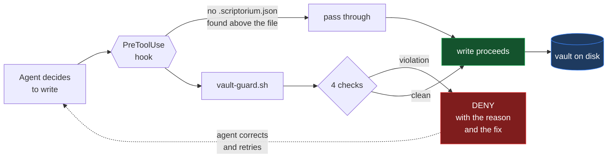
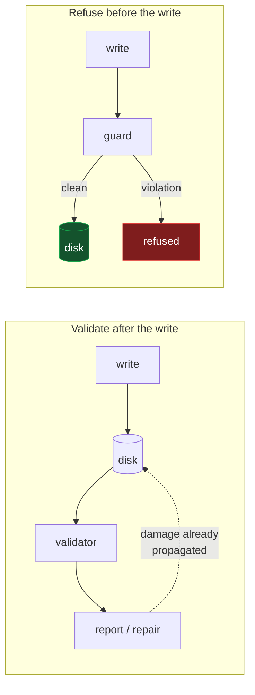
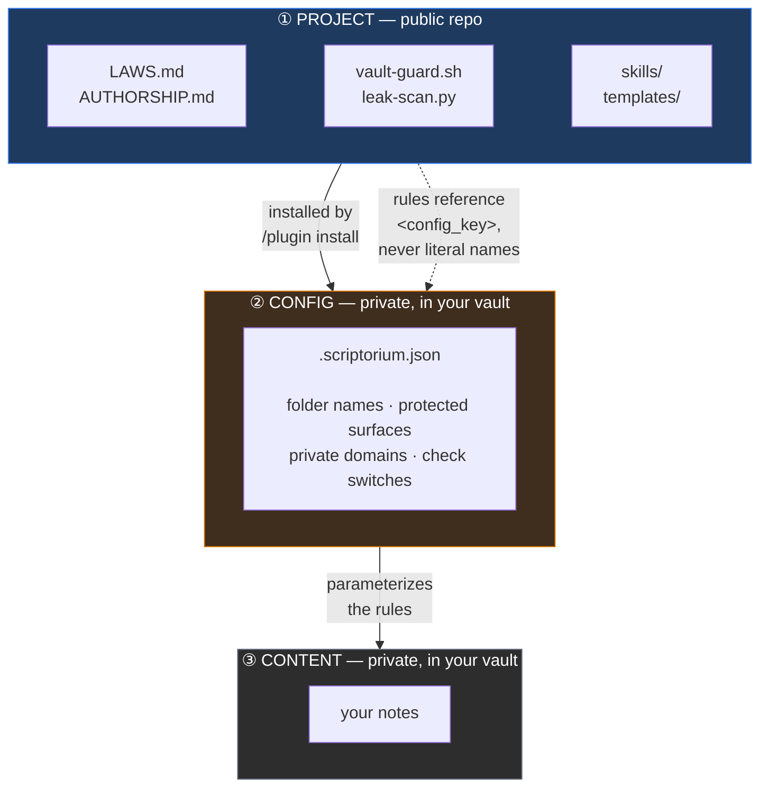

# Architecture

Two diagrams carry the whole design: **where a write is stopped**, and **which directory owns a change**. Everything else is prose.

## 1. The write path

The premise of this project is that an instruction is a suggestion with good intentions. The difference between a rule an agent is *told* and a rule that is *enforced* is entirely a matter of where in this path the check sits.

**The denied write never reaches disk.** That is the entire difference from a validator that runs after the write and then reports or repairs:

For a hard-wrapped paragraph the two are nearly equivalent — reflowing afterwards is fine. For a comma-joined wikilink in YAML they are not: that string **puts a phantom entry in the graph the instant it lands**, named after the whole string. To be precise, no file is created at that moment — which is exactly why it goes unnoticed — and one appears at the vault root as soon as anyone clicks it, carrying no record of which note produced it. Refusal means it never appears.

### Fail-closed on detection, fail-open on failure

These sound contradictory and are not.

- A **detected violation** is refused. That is fail-closed, and it is the point.
- A **guard that cannot run** — no `jq`, no `python3`, no config file found — exits silently and lets the write through.

The second is deliberate. A guard that crashes and blocks every write gets uninstalled the same day, and then nothing is enforced at all. Fail-open on guard failure is what buys fail-closed on guard success.

## 2. Three layers, and who owns a change

The hard problem in a project like this is not writing the rules. It is that the author develops them *inside their own live vault*, so every improvement has to be sorted into "belongs to everyone" or "belongs to me" — and getting that wrong either leaks private material into public rule text or strands a good rule where nobody else gets it.

**The split test is mechanical: which directory did you just edit?**

| You edited | It is | It goes |
|---|---|---|
| Anything in the repo | A project change | Committed — everyone gets it on update |
| `.scriptorium.json` | A parameter | Nowhere. Stays yours, permanently |
| A note | Content | Nowhere |

This is deliberately not a judgment call. A convention that depends on classifying each change correctly in the moment is the same kind of rule as "remember not to hard-wrap" — it works until the day it doesn't, and it fails silently.

### Why the seam runs through the middle of each law

The obvious design is to sort laws into a public pile and a private pile. It does not work, because **almost every law is a portable rule wrapped around personal parameters.** "Never write a stray markdown file at the vault root" is universal; *which* basenames are permitted at your root is yours. A law is rarely wholly public or wholly private, so the parameter is extracted and the rule ships.

That is why `LAWS.md` never names a folder. Every reference is a config key, and a vault that has not configured one simply does not get that check.

## 3. Configuration resolution

There is no path setting and no environment variable. The hook takes the file being written, walks up its parent directories, and stops at the first one containing `.scriptorium.json`. **That directory is the vault root.**

The consequence worth knowing: outside a directory tree containing that file, the hook does nothing at all. You can install this globally and it stays inert everywhere except the vaults you have configured.

## 4. What runs where

| Component | Trigger | Harness |
|---|---|---|
| `vault-guard.sh` | `PreToolUse` on `Write`/`Edit` | Claude Code — hook contracts are per-harness, inert elsewhere |
| `LAWS.md`, `AUTHORSHIP.md`, `AGENTS.md` | Read by the agent | Any — plain markdown |
| `skills/` | Agent-invoked | Any [Agent Skills](https://agentskills.io) host, including Codex CLI |
| `leak-scan.py` | `pre-commit` | Git, on the contributor's machine |
| `first-party-inventory.sh` | Manual | Any shell |

The portable half is markdown; the enforced half is the hook. A Codex user gets the laws and the skills and does not get the refusal — which is exactly the gap this project argues matters.
