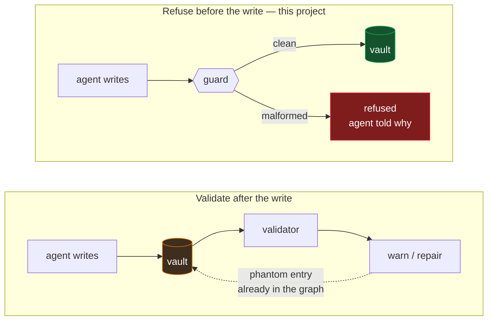

# Scriptorium

**Fail-closed guardrails for agent-written Obsidian vaults.**

Your agent writes notes faster than you read them. A fraction come out quietly malformed — not broken enough to error, just wrong enough to corrupt links, render badly, or go missing from search. You find out weeks later.

## The number this project exists for

One vault, roughly 2,000 notes, largely written by Claude Code. The owner noticed that prose was being hard-wrapped at 80 columns — invisible on GitHub, but Obsidian renders every single newline as a visible break, so paragraphs were splitting mid-sentence throughout the vault.

| | Files needing repair |
|---|---|
| The backfill that found the problem | **857** |
| The next day, with the rule written at the top of the agent's instruction file | **123** |
| The following month, with the same rule enforced as a hook | **3** |

The rule did not change between rows two and three. **Only its enforcement did.**

That middle row is the whole argument. The rule was clear, prominent, and re-read by the agent every session — and it was violated **27 minutes** after being written, then 123 more times the next day.

And the 3 are honest: those arrived through shell commands and sync, which a `PreToolUse` hook cannot see. See [Limitations](#limitations).

## Is this for you?

**Yes, if:** an agent writes a meaningful share of your notes, you have found malformed files you did not write, and you have caught yourself adding rules to `CLAUDE.md` that the agent then ignores.

**Also yes, if you are starting from nothing.** The guard is the enforcement layer of a complete system, and the system ships with it: [`METHOD.md`](METHOD.md) is the folder structure, the filing rules and the daily loop, and `/scriptorium:init` will build the whole thing in an empty directory. You do not need an existing vault or an existing convention.

**Probably not, if:** you write your notes yourself and use AI to search or summarise them. Nothing here will fire. Your notes are fine.

**Not what this is:** a security tool. It assumes a cooperative agent that is trying to help and getting the format wrong. It will not stop a destructive command, and it is not a defence against anything adversarial.

## Why an instruction is not enough

An instruction is a suggestion with good intentions. It competes for attention with everything else in the context window, and an agent writing hundreds of files will eventually violate any rule it is merely *told*.

Markdown corruption is a bad match for that, because it is **quiet**. Nothing errors. Nothing crashes. A malformed note looks fine in the editor and wrong in the renderer, or looks fine in both and simply never comes back from a search. The gap between the mistake and the discovery is measured in weeks.

A hook does not compete for attention. It runs on every write and returns a decision.

### Prevention, not detection

Other tools validate *after* the write and repair the damage. Scriptorium refuses it.



For a hard-wrapped paragraph the difference is small — reflowing afterwards works. For others it is not, and the agent is also told *why* it was refused, so it corrects instead of repeating the mistake.

## What it refuses

Ordered by how much trouble each one actually causes. Every check is individually switchable.

| Check | Default | What goes wrong without it |
|---|---|---|
| **Hard-wrapped prose** | on | Obsidian renders a single newline as a visible break. An 80-column wrap is invisible on GitHub and splits paragraphs mid-sentence here. This is the one with the numbers above |
| **Multi-wikilink YAML** | on | `related: "[[A]], [[B]]"` parses as *one* link target. A phantom entry named after the whole string appears in your graph, and becomes a real empty file the moment anyone clicks it |
| **Stray root markdown** | on | Agents scatter summary files at the vault root. Individually harmless, cumulatively the reason nobody can find anything |
| **Missing folder landing** | **off** | `[[Folder]]` resolves only to `Folder.md`, never `Folder/index.md`. Enforces a convention Obsidian has no native concept of, so it ships off — turn it on once it matches your structure |

Nine further laws are specified in [`LAWS.md`](LAWS.md) and held by the agent rather than the hook. They are the specification for the checks that should replace them.

## Install

```
/plugin marketplace add billylui/scriptorium
```
```
/plugin install scriptorium@scriptorium
```
```
/plugin list
```

You want `scriptorium@scriptorium` showing **enabled**. A plugin that fails to load enforces nothing, and looks exactly like one that is working.

Then, with Claude Code open in your vault:

```
/scriptorium:init
```

It reads your vault, proposes values, asks what it cannot infer, writes `.scriptorium.json` at your vault root, and **makes the guard refuse a write in front of you.**

Full walkthrough, including setting up someone else's machine: [`SETUP.md`](SETUP.md).

**The vault root is wherever `.scriptorium.json` lives.** No path setting, no environment variable. Outside a directory containing one the hook does nothing, so a global install leaves every other directory untouched.

## Verify

```
/scriptorium:verify
```

Run it after any config change, or whenever you are about to rely on this. **An inert guard and a working guard are indistinguishable until one of them says no.**

## Limitations

Read [`SECURITY.md`](SECURITY.md) before relying on this.

- **The hook sees `Write` and `Edit` only.** An agent with shell access bypasses every check with a heredoc or `sed -i` — and bulk shell edits are exactly when a convention gets violated at scale. This is how 3 of the files above got through.
- **Nothing else is covered:** sync services, mobile apps, your editor, other agents, `git checkout`.
- **Shape, not truth.** A perfectly formatted note that is completely wrong passes.
- **It fails open when it cannot run** — no `jq`, no config, check disabled. Absence of refusals is not evidence of coverage.

## Documentation

| File | For | Contents |
|---|---|---|
| [`METHOD.md`](METHOD.md) | humans | **The system itself** — folder structure, projects vs areas, the capture loop, people, review cadence, your first month |
| [`CHANNELS.md`](CHANNELS.md) | humans | Optional: reaching your vault from Telegram, Discord or iMessage |
| [`LAWS.md`](LAWS.md) | both | The full rule set: the mechanism each law prevents, and the config key that parameterizes it |
| [`AUTHORSHIP.md`](AUTHORSHIP.md) | both | Once an agent writes most of your vault, that prose stops being evidence of how *you* think. Protected surfaces, provenance, truth hierarchy |
| [`ARCHITECTURE.md`](ARCHITECTURE.md) | humans | Where a write is stopped, and which directory owns a change |
| [`SETUP.md`](SETUP.md) | agents | Executable install, with the steps no agent can do marked **HUMAN** |
| [`SECURITY.md`](SECURITY.md) | both | What the guard cannot protect against |
| [`CONTRIBUTING.md`](CONTRIBUTING.md) | both | The leak-scan rule, and "demonstrate the red" |

## Portability

| Component | Works with |
|---|---|
| Laws, skills, templates | Claude Code, Codex CLI, and other [Agent Skills](https://agentskills.io) hosts |
| The `PreToolUse` hook | Claude Code — hook contracts are per-harness, inert elsewhere |

**This is not a rivalry with vault-memory projects.** They give an agent somewhere durable to think; this refuses the malformed writes that accumulate in whatever it thinks into. If you run one, this guards the vault it gave you.

## Status and support

**A published artifact of a working system, not a supported product.** It runs daily against the vault the numbers above came from, which is why the rules exist — every one was written after something broke.

Issues are welcome as signal and may sit. PRs may sit longer. If you need a guarantee, fork it — a genuine suggestion, not a brush-off.

The most useful thing anyone can send is a case where the guard passed a write it should have refused.

## License

[MIT](LICENSE).
